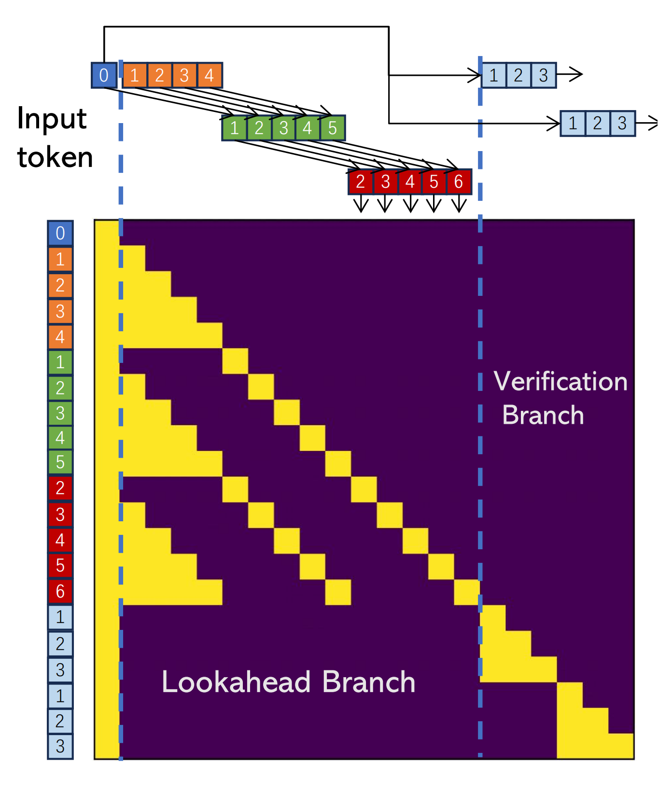
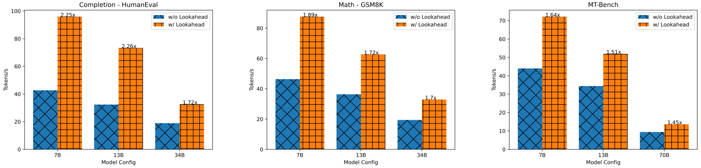

<div align="center"><h1>&nbsp;Break the Sequential Dependency of LLM Inference Using Lookahead Decoding</h1></div>

<p align="center">
| <a href="https://lmsys.org/blog/2023-11-21-lookahead-decoding/"><b>Blog</b></a> | <a href="ROADMAP.md"><b>Roadmap</b></a> | 
</p>

## Introduction 
We introduce lookahead decoding:
- A parallel decoding algo to accelerate LLM inference.
- Without the need for a draft model or a data store.
- Linearly decreases #decoding steps relative to log(FLOPs) used per decoding step.

Below is a demo of lookahead decoding accelerating LLaMa-2-Chat 7B generation:

<div align="center">
  <picture>
  
  </picture>
  <br>
  <div align="center" width="80%">
  <em>Demo of speedups by lookahead decoding on LLaMA-2-Chat 7B generation. Blue fonts are tokens generated in parallel in a decoding step.</em>
  </div>
  <br>
</div>

### Background: Parallel LLM Decoding Using Jacobi Iteration

Lookahead decoding is motivated by [Jacobi decoding](https://arxiv.org/pdf/2305.10427.pdf), which views the autoregressive decoding as solving nonlinear systems, and decodes all future tokens at once using fixed-point iteration method. Below is an Jacobi decoding example.

<div align="center">
  <picture>
  
  </picture>
  <br>
  <div align="center" width="80%">
  <em>Illustration of applying Jacobi iteration method for parallel LLM decoding.</em>
  </div>
  <br>
</div>

However, Jacobi decoding can barely see wall-clock speedup in real-world LLM applications.

### Lookahead Decoding: Make Jacobi Decoding Feasible

Lookahead decoding takes advantage of Jacobi decoding’s ability by collecting and caching n-grams generated from Jacobi iteration trajectories.

The following gif shows the process of collecting 2-grams via Jacobi decoding and then to verify them to accelerate decoding.

<div align="center">
  <picture>
  
  </picture>
  <br>
  <div align="center" width="80%">
  <em>Illustration of lookahead decoding with window size 5 and 2-gram.</em>
  </div>
  <br>
</div>

To enhance the efficiency of this process, each lookahead decoding step is divided into two parallel branches: the lookahead branch and the verification branch. The lookahead branch maintains a fixed-sized, 2D window to generate n-grams from the Jacobi iteration trajectory. Simultaneously, the verification branch selects and verifies promising n-gram candidates.

### Lookahead Branch and Verification Branch

The lookahead branch aims to generate new N-grams. The branch operates with a two-dimensional window, defined by two parameters:

window size W: how far ahead we look in future token positions to conduct parallel decoding.

N-gram size N: how many steps we look back into the past Jacobi iteration trajectory to retrieve n-grams.

We implement the two branches in one attention mask to further utilize GPU's parallel computing power.

<div align="center">
  <picture>
  
  </picture>
  <br>
  <div align="center" width="80%">
  <em>Attention mask for lookahead decoding with 4-grams and window size 5. In this mask, two 4-gram candidates (bottom right) are verified concurrently with parallel decoding.</em>
  </div>
  <br>
</div>

### Experimental Results

Our study shows lookahead decoding substantially reduce latency, ranging from 1.5x to 2.3x on different datasets, on a single GPU. See figure below.

<div align="center">
  <picture>
  
  </picture>
  <br>
  <div align="center" width="80%">
  <em>Speedup of lookahead decoding on different models and datasets.</em>
  </div>
  <br>
</div>

## Contents
- [Introduction](#introduction)
- [Contents](#contents)
- [Installation](#installation)
  - [Install With Pip](#install-with-pip)
  - [Install From The Source](#install-from-source)
  - [Inference](#inference)
  - [Use In Your Own Code](#inference-plugin)
- [Citation](#citation)
- [Guidance](#guidance)


## Installation
### Install with pip
```bash
pip install lade
```
### Install from the source
```bash
git clone https://github.com/hao-ai-lab/LookaheadDecoding.git
cd LookaheadDecoding
pip install -r requirements.txt
pip install -e .
```

### Inference With Lookahead decoding
You can run the minimal example to see the speedup that Lookahead decoding brings.
```bash
python minimal.py #no Lookahead decoding
USE_LADE=1 LOAD_LADE=1 python minimal.py #use Lookahead decoding, 1.6x speedup
```

You can also enjoy chatting with your own chatbots with Lookahead decoding.
```bash
USE_LADE=1 python applications/chatbot.py  --model_path meta-llama/Llama-2-7b-chat-hf --debug --chat #chat, with lookahead 
USE_LADE=0 python applications/chatbot.py  --model_path meta-llama/Llama-2-7b-chat-hf --debug --chat #chat, without lookahead


USE_LADE=1 python applications/chatbot.py  --model_path meta-llama/Llama-2-7b-chat-hf --debug #no chat, with lookahead
USE_LADE=0 python applications/chatbot.py  --model_path meta-llama/Llama-2-7b-chat-hf --debug #no chat, without lookahead
```

### Use Lookahead decoding in your own code
You can import and use Lookahead decoding in your own code in three LoCs. You also need to set ```USE_LADE=1``` in command line or set ```os.environ["USE_LADE"]="1"``` in Python script. Note that Lookahead decoding only support LLaMA and Greedy Search yet.

```python
import lade
lade.augment_all()
lade.config_pading(LEVEL=5, WINDOW_SIZE=7, GUESS_SET_SIZE=7, DEBUG=0) 
#LEVEL, WINDOW_SIZE and GUESS_SET_SIZE are three important configurations (N,W,G) in lookahead decoding, please refer to our blog!
#You can obtain a better performance by tuning LEVEL/WINDOW_SIZE/GUESS_SET_SIZE on your own device.
```

Then you can speedup the decoding process.
```
tokenizer = AutoTokenizer.from_pretrained(model_name)
model = AutoModelForCausalLM.from_pretrained(model_name, torch_dtype=torch.float16, device_map=torch_device)
model_inputs = tokenizer(input_text, return_tensors='pt').to(torch_device)
greedy_output = model.generate(**model_inputs, max_new_tokens=1024) #speedup obtained
```

## Citation
```bibtex
@misc{fu2023lookahead,
    title = {Breaking the Sequential Dependency of LLM Inference Using Lookahead Decoding},
    url = {https://lmsys.org/blog/2023-11-21-lookahead-decoding/},
    author = {Yichao Fu and Peter Bailis and Ion Stoica and Hao Zhang},
    month = {November},
    year = {2023}
}
```
## Guidance
The core implementation is in decoding.py. Lookahead decoding requires an adaptation for each specific model. An example is in models/llama.py.

